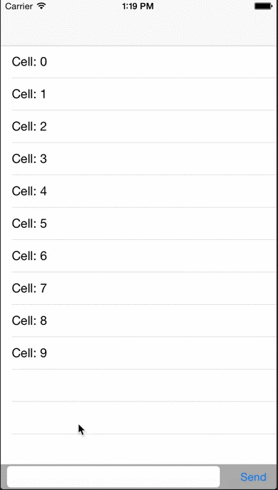
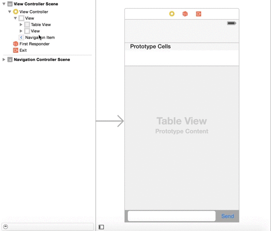

# ChatKeyboard
Chat keyboard dismissal with drag. 

Very easy with minimal lines of code.

Create UIView outlet and customize it any way you want.

@property (nonatomic, weak) IBOutlet UIView *accessoryView;

Add the following to activate the accessory.

- (UIView *)inputAccessoryView
{
    return _accessoryView;
}

- (BOOL)canBecomeFirstResponder
{
    return YES;
}

Create a custom UIView in your ViewController in Storyboard and add it as follows.
Make sure whatever scrollView you're using, the Keyboard settings is Dismiss interactively.

